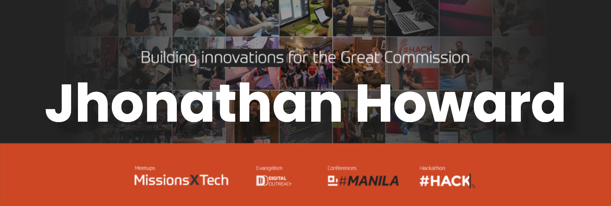

<h2> Hey there! I'm Howard.</h2>

<h3> 👨🏻‍💻 &nbsp;About Me </h3>

- 🤔 &nbsp; Exploring new technologies and developing software solutions and quick hacks.
- 🎓 &nbsp; Studied CoET at Technological University of the Philippines.
- 💼 &nbsp; Working as a DevOps Engineer at TechStyleOS.
- 🌱 &nbsp; Learning more about Cloud Architecture, Systems Design and Artificial Intelligence.
- ✍️ &nbsp; Pursuing Graphic Design and Blog Writing as hobbies/side hustles.

<h3> 🛠 &nbsp;Tech Stack</h3>

- 💻 &nbsp;
  
  
  
  
- 🌐 &nbsp;
  
  
  
  
  
  
- 🛢 &nbsp;
  
  
- ⚙️ &nbsp;
  
  
  
 

### ⚙️ &nbsp;GitHub Analytics

<h3> 🤝🏻 &nbsp;Connect with Me </h3>

